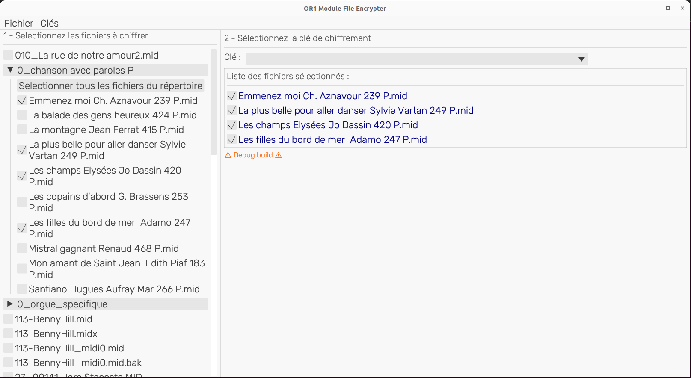

# OR1 encrypter tool

Cet outil permet de chiffrer les éléments musicaux pour les modules OR1.
Le module OR1, est un boitier electronique (serinette, permettant de jouer des morceaux)
[https://www.barrel-organ-discovery.org/or1/](https://www.barrel-organ-discovery.org/or1/)

## Changelog
   - ajout du choix du répertoire
   - ajout de la définition des clés par texte (cles RSA)
   - amélioration d'interface graphique

